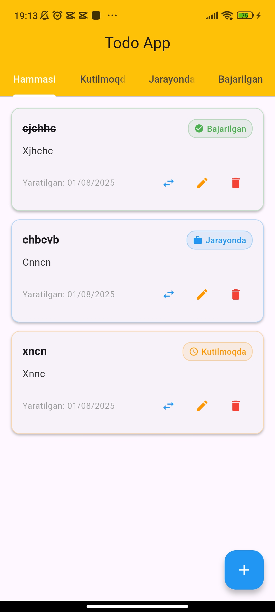
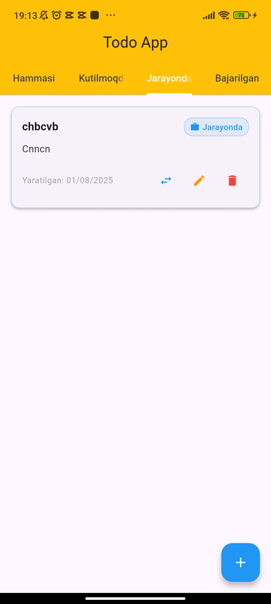
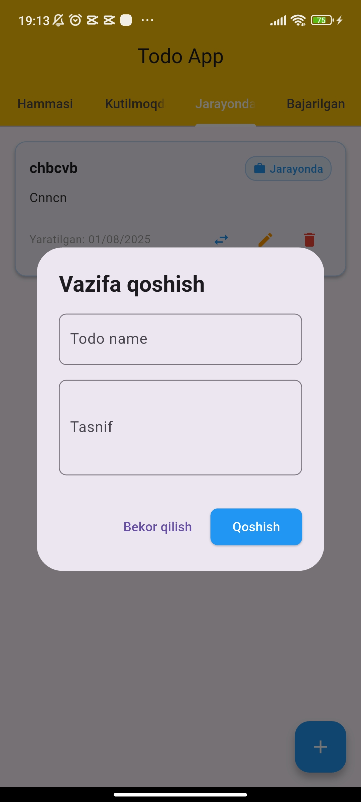

# 📝 Flutter ToDo App

A simple and efficient to-do app built with Flutter. Manage your daily tasks easily using a minimal, clean interface.  
Built using `flutter_bloc` for state management and `sqflite` for local database storage.

---

## 🚀 Features

- ✅ Add new tasks
- ✅ Edit existing tasks
- ✅ Mark tasks as completed
- 🗑 Delete tasks
- 📁 Filter tasks by status (e.g. completed, pending)

---

## 📱 Screenshots

---

## 🧰 Tech Stack

- 🧱 **State Management:** flutter_bloc
- 🗃 **Local Database:** sqflite
- 🎨 **UI:** Flutter Material Design

